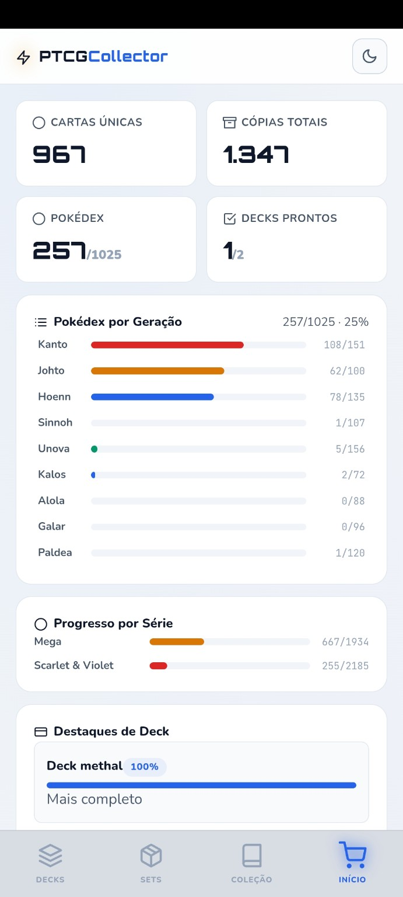
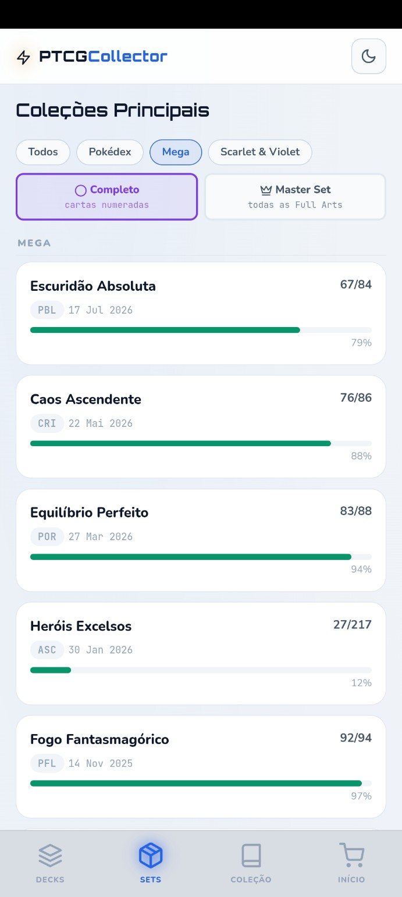
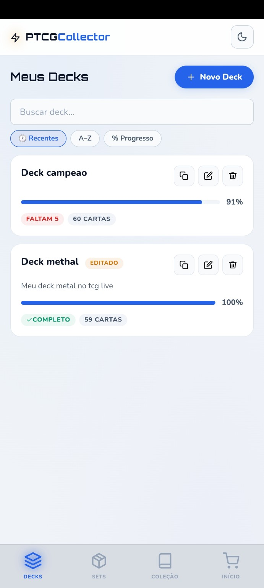
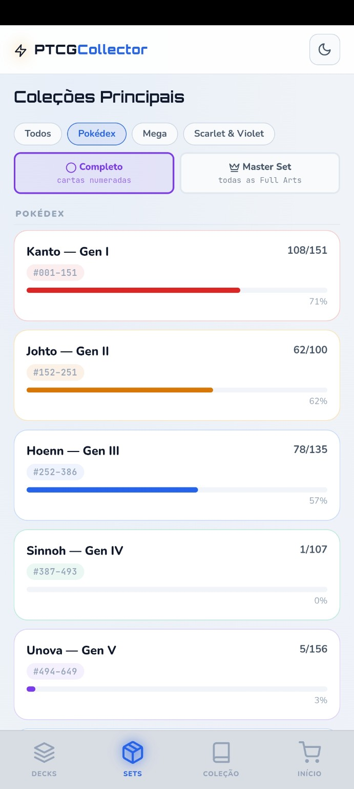
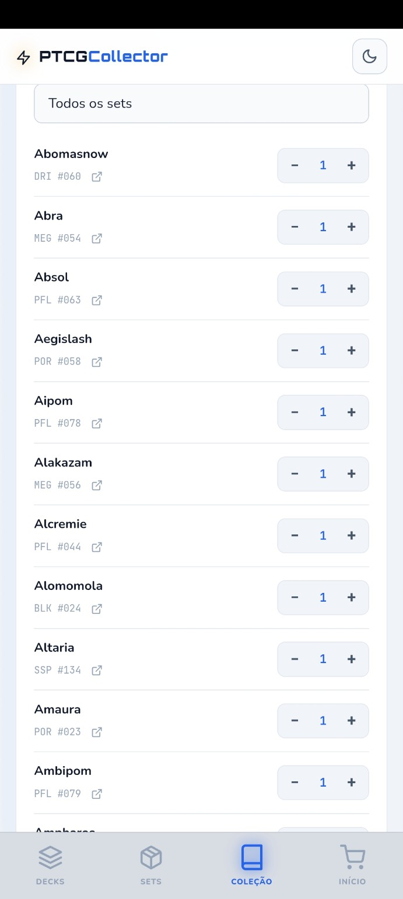

# PTCGCollector

Gerenciador Android para coleção, decks, Pokédex e acompanhamento de progresso no Pokémon TCG.

<p align="center">
  
  
  
</p>

<p align="center">
  
  
</p>

## Visão geral

O **PTCGCollector** foi desenvolvido para centralizar o gerenciamento de uma coleção de Pokémon TCG em uma interface simples e adequada para uso no celular.

O aplicativo permite acompanhar progresso por coleção, controlar cópias, organizar decks, consultar a Pokédex e visualizar estatísticas gerais da coleção.

## Principais recursos

- Controle de cartas por coleção
- Quantidade de cópias por carta
- Progresso de sets por percentual
- Filtros por série e Pokédex
- Pokédex separada por geração
- Gerenciamento de decks
- Indicador de cartas faltantes por deck
- Lista de compras
- Dashboard com estatísticas gerais
- Importação e exportação de dados
- Persistência local no Android
- Tema claro e escuro

## Screenshots

### Dashboard

Visão consolidada da coleção, com cartas únicas, cópias totais, Pokédex, decks completos e progresso por geração e série.

<p align="center">
  
</p>

### Coleções

Acompanhamento de progresso por set, com separação entre coleção numerada e Master Set.

<p align="center">
  
</p>

### Pokédex

Progresso individual das gerações, do Kanto até Paldea.

<p align="center">
  
</p>

### Decks

Criação, acompanhamento e edição de decks, incluindo percentual de conclusão e quantidade de cartas faltantes.

<p align="center">
  
</p>

### Minha coleção

Consulta e atualização das quantidades possuídas de cada carta.

<p align="center">
  
</p>

## Arquitetura

O código web principal fica em `web-src/` e é organizado por responsabilidade:

```text
web-src/
├── index.html
├── css/
│   └── app.css
├── data/
│   ├── sets/
│   ├── sets.generated.js
│   └── pokedex/
│       └── pokedex.generated.js
└── js/
    ├── core/
    │   ├── helpers.js
    │   ├── state.js
    │   ├── android-bridge.js
    │   └── storage.js
    ├── features/
    │   ├── collection.js
    │   ├── dashboard.js
    │   ├── decks.js
    │   ├── pokedex.js
    │   ├── sets.js
    │   └── shopping.js
    ├── ui/
    │   ├── layout.js
    │   ├── events.js
    │   ├── events-navigation.js
    │   ├── events-interactions.js
    │   ├── events-decks.js
    │   ├── events-collection.js
    │   └── events-history.js
    └── app.js
```

Os arquivos de `web-src/` são a fonte principal da aplicação. Durante o build, eles são copiados para:

```text
apk-project/app/src/main/assets/
```

## Validação e build

Na raiz do projeto:

```bash
python scripts/validate_data.py
python scripts/build.py
python -m unittest discover -s tests -v
```

Para executar a regressão automatizada completa:

```bash
python scripts/regression_check.py
```

## Gerar o APK

No Windows:

```powershell
cd apk-project
.\gradlew.bat assembleDebug
```

O APK será gerado em:

```text
apk-project/app/build/outputs/apk/debug/app-debug.apk
```

Para instalar uma atualização preservando os dados existentes:

```powershell
adb install -r app\build\outputs\apk\debug\app-debug.apk
```

## Adicionar uma nova coleção

Prepare um CSV com as colunas:

```csv
number,name
001,Nome da carta
002,Outra carta
```

Depois execute:

```bash
python scripts/add_set.py \
  --code NOV \
  --name "Nova Coleção" \
  --series "Mega" \
  --release-date 2026-10-01 \
  --numbered 100 \
  --complete 130 \
  --input nova-colecao.csv \
  --build
```

O fluxo valida o CSV, cria o JSON da coleção, valida os dados e atualiza os assets usados pelo aplicativo.

## Estrutura de dados

As coleções ficam em:

```text
web-src/data/sets/
```

Os dados da Pokédex ficam em:

```text
web-src/data/pokedex/
```

## Testes

Os testes automatizados ficam em:

```text
tests/
```

Eles verificam estrutura modular, carregamento dos módulos, consistência dos dados e regressões estruturais.

## Desenvolvimento

Para alterações na interface ou nas regras do aplicativo, edite preferencialmente os arquivos de:

```text
web-src/
```

Depois execute:

```bash
python scripts/regression_check.py
```

e gere novamente o APK.

## Status do projeto

Projeto em desenvolvimento ativo, com arquitetura modular, build automatizado e regressão validada em APK Android.
